  

  

  

  

  

---

### 🚀 About Me

I'm a developer who works across the full stack — building modern web applications, designing backend systems, automating workflows with AI/LLMs, and shipping projects through solid DevOps pipelines.

---

### 🎨 Frontend

  

---

### ⚙️ Backend

  

Also working with: **REST API Design, Authentication & Security, and System Design.**

---

### 🤖 AI / Automation

  

  

  

  

Also working with: **RAG (Retrieval-Augmented Generation) and LLM-based systems.**

---

### 🛠️ DevOps

  

Also working with: **Bash & Python Automation, CI/CD Pipelines, AWS EKS, Observability, DevSecOps, and AIOps.**

---

### 📊 GitHub Stats

<!-- GitHub Profile Details -->

  

<!-- GitHub Stats & Top Languages -->

  

  

<!-- GitHub Streak -->

  

---

### 📌 Featured Projects

| Project                                                                     | Description                           | Tech Stack                      |
| --------------------------------------------------------------------------- | ------------------------------------- | ------------------------------- |
| [Royal Bank](https://github.com/rifathowladar/Royal-bank)                   | A modern full-featured banking system | React, TypeScript, Tailwind CSS |
| [Fashion Marketplace](https://github.com/rifathowladar/Fashion-Marketplace) | A single-vendor e-commerce platform   | React, Node.js                  |
| [Ecobazar Dashboard](https://github.com/rifathowladar/Ecobazar-Dashboard)   | Modern e-commerce dashboard           | React, Node.js                  |

---

